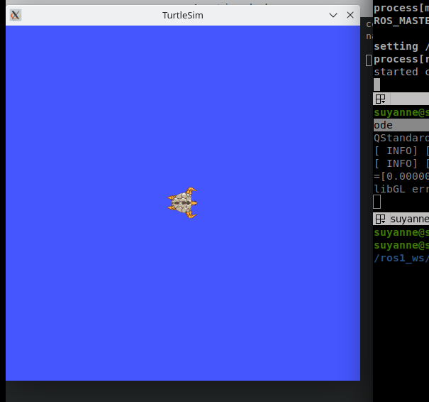
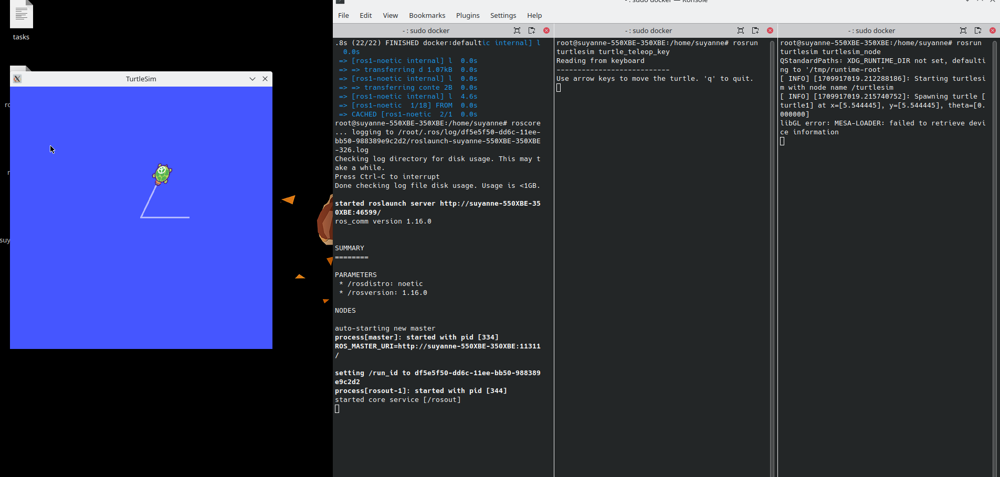

### 🚢 Running Your First ROS Node Through a Docker Container
This guide outlines the steps to run your first ROS node through a Docker container. The Docker container is pre-configured with Ubuntu 20.04 and ROS Noetic.

*Based on: [Docker container with pre-installed Ubuntu20.04 and ROS Noetic](https://medium.com/@sepideh.92sh/how-docker-revolutionizes-application-development-a-comprehensive-guide-for-beginners-fc2d3e53eb31)*

### Docker Container Information
- **Base Image**: Ubuntu 20.04
- **ROS Distribution**: Noetic

### Prerequisites
- Docker and docker compose installed on your system. You can check if Docker is installed by running `docker --version` in your terminal.

### Steps

#### 1. Clone the Repository
Clone the repository containing the Dockerfile:

```bash
   git clone git@github.com:Suyannesara/ROS-noetic-docker.git
   cd ROS-noetic-docker
```

#### 2. Build the Docker Image

The Dockerfile provided in this project defines an image with ROS Noetic installed.

**Modify your bashrc file to source ros1 itens:**
The comands above are necessary in order to source ros1 itens. In your terminal, paste:
NOTE: You should do it only ONCE, the first time you are running this tutorial in your machine.

```bash
   echo "source /opt/ros/noetic/setup.bash" >> ~/.bashrc
   echo "source /opt/ros/noetic/setup.sh" >> ~/.bashrc
   source ~/.bashrc
```

**Modify the Dockerfile to use your system user:**

Then, build the image by running the following command in your terminal:
```Dockerfile
ARG USER=your_os_user
```
⚠️ **Warning**: Ensure to replace `your_os_user` with your actual system username. Also, make sure you are inside this project's root folder to run the next commands.

#### 3. Run the Container

Run the container based on the defined image using the following commands:

```bash
   sudo docker compose up -d
```
It is normal if it takes long to build for the first time!

##### 3.1 Start multiple docker terminals

Once you've done the steps till now, your docker container is running on your machine in the background, so that you are able to open multiple instances of the container with the command:

```bash
   sudo docker exec -it ros-noetic-container /bin/bash
```

This will open your container work around.


#### 4. Run Gazebo inside docker container
In a terminal OUTSIDE the container one, run:
```bash
   xhost +local:docker
```

Then, gazebo will be able to launch any ways you need. You can check by pasting the comand above INSIDE container terminal:
```bash
   gazebo
```

#### 5. Run Your First ROS1 Node

##### 5.1 Run `roscore`
Inside a container terminal instance, run the following command to start `roscore`:

```bash
   roscore
```

##### 5.2 Run the Turtlesim Node
In another docker container terminal instance (that you can open with the command in section 4.1), run the following command to start the Turtlesim node:

```bash
   rosrun turtlesim turtlesim_node
```

(Do not close the window with `roscore` running; they both should be opened)


This should open a window displaying the Turtlesim environment like this:




*🛑 Please note: By default, systems may NOT allow opening graphical tools as root, which is the case with Docker. If the Turtlesim window does not appear, kill the process and paste `xhost si:your_os_user:root` in the terminal, make sure to replace `your_os_user` with your actual system user. If issues persist, you can find more information about this problem here: [StackOverflow question help]https://stackoverflow.com/questions/48833451/no-protocol-specified-when-running-a-sudo-su-app-on-ubuntu-linux.*

##### 4.4 Control the Turtle
In another docker container instance terminal tab, run the following command to control the turtle using keyboard inputs:

```bash
   rosrun turtlesim turtle_teleop_key
```

### Final Look:

Just to clarify, at the end of the process, you should have something like this, with 3 terminal tabs open, 2 of them taking care of running two different nodes, and the other running the roscore environment, necessary for running the nodes.



**You can exit each docker terminal instance by typing "exit"**

🎉 **All done**: Now, you can use the arrow keys on your keyboard to control the movement of the turtle in the Turtlesim environment.